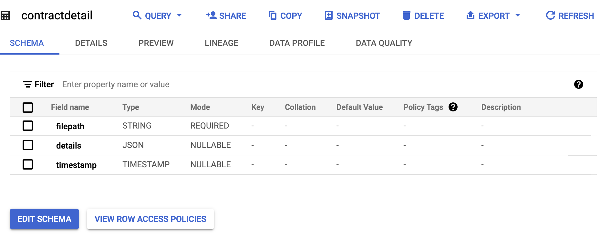

# contractanalysis


 

 In order to create the funciton you need to give some permission to the service account. You can create a new service account or use an existing default one for Cloud Funciton. Here is how you can setup a new service account and give it the relevant permissions:

```
gcloud iam service-accounts create contractfunction-handler --description="Receives and processes events from Google Chat" --display-name="contractfunction handler"
```
```
gcloud projects add-iam-policy-binding [PROJECT_ID] --member="serviceAccount:contractfunction-handler@[PROJECT_ID].iam.gserviceaccount.com" --role="roles/aiplatform.user"

gcloud projects add-iam-policy-binding [PROJECT_ID] --member="serviceAccount:contractfunction-handler@[PROJECT_ID].iam.gserviceaccount.com" --role="roles/storage.objectViewer"

gcloud projects add-iam-policy-binding [PROJECT_ID] --member="serviceAccount:contractfunction-handler@[PROJECT_ID].iam.gserviceaccount.com" --role="roles/bigquery.dataEditor"

gcloud projects add-iam-policy-binding [PROJECT_ID] --member="serviceAccount:contractfunction-handler@[PROJECT_ID].iam.gserviceaccount.com" --role="roles/cloudfunctions.serviceAgent"

gcloud projects add-iam-policy-binding [PROJECT_ID] --member="serviceAccount:contractfunction-handler@[PROJECT_ID].iam.gserviceaccount.com" --role="roles/run.invoker"
```

You also need to create Environment variables for the BiqQuery connections:

```
PROJECT_ID
DATASET_ID
TABLE_ID
```

The schema I have used for the Bigquery table is below:



Here is the sample SQL for creating a dataset in Looker Studio for the front end dashboard:

```
SELECT filepath, 
JSON_VALUE (details, '$.contract_type') as contract_type, 
JSON_VALUE (details, '$.value') as value, 
JSON_VALUE (details.parties[0], '$.name') party1_name,
JSON_VALUE (details.parties[0], '$.role') party1_role,
JSON_VALUE (details.parties[1], '$.name') party2_name,
JSON_VALUE (details.parties[1], '$.role') party2_role,
JSON_VALUE (details, '$.confidentiality_provisions') confidentiality_provisions,
JSON_VALUE (details, '$.termination_clauses') termination_clauses,
FROM `genaillentsearch.contractanalysis.contractdetail` LIMIT 1000
```